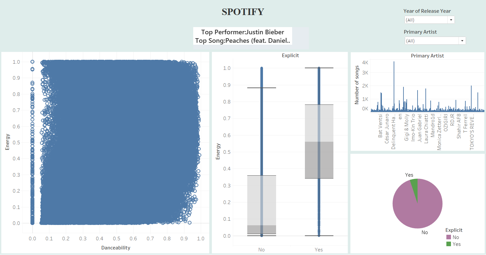

# 🎵 Spotify Data Dashboard (Tableau)

This repository contains an interactive dashboard built in **Tableau** to explore and analyze Spotify song-level data. The dashboard presents visual insights into song characteristics, artist trends, and explicit content distribution.

---

## 📊 Dashboard Overview

### 🧠 KPIs Displayed
- **Top Performer:** Artist with the most popular song across all years.
- **Top Song:** The most popular song (based on popularity score).

### 📈 Visual Components
1. **Scatterplot (Danceability vs Energy):**
   - Visualizes how danceability correlates with energy.
   - Useful to segment songs by mood (e.g., Party, Chill).

2. **Boxplot (Explicit vs Energy):**
   - Compares the distribution of energy in explicit vs. non-explicit songs.
   - Highlights differences in energy trends based on explicitness.

3. **Bar Chart (Top Artists by Song Count):**
   - Shows the number of songs for each artist.
   - Useful to identify prolific artists on the platform.

4. **Pie Chart (Explicit Content Ratio):**
   - Distribution of explicit vs. non-explicit songs.
   - Provides a quick glance at overall content type.

5. **Dropdown Filters:**
   - **Year of Release**
   - **Primary Artist**
   - Enables dynamic filtering across all visualizations.

---

## 🔧 Tools & Technologies

- **Tableau Public / Desktop**: Data visualization
- **Spotify Dataset (CSV)**: Song-level features from Spotify API (energy, danceability, etc.)
- **Word**: Analysis of the dataset

---

## 🧪 Dataset Features

The dataset includes the following key columns:
- `track_name`: Name of the song
- `artist`: Primary artist
- `release_year`: Year the song was released
- `popularity`: Popularity score (Spotify)
- `danceability`: Float score (0.0–1.0)
- `energy`: Float score (0.0–1.0)
- `explicit`: Boolean (Yes/No)
- ... and more

---

## 📌 Key Insights

- **Justin Bieber** is identified as the **Top Performer**, with **“Peaches”** being the most popular song in the dataset.
- **Explicit songs** tend to have slightly **higher energy levels**.
- Majority of the dataset songs are **non-explicit**.
- There is a strong presence of **high danceability + high energy songs**, which could be segmented as “Party” mood songs.

